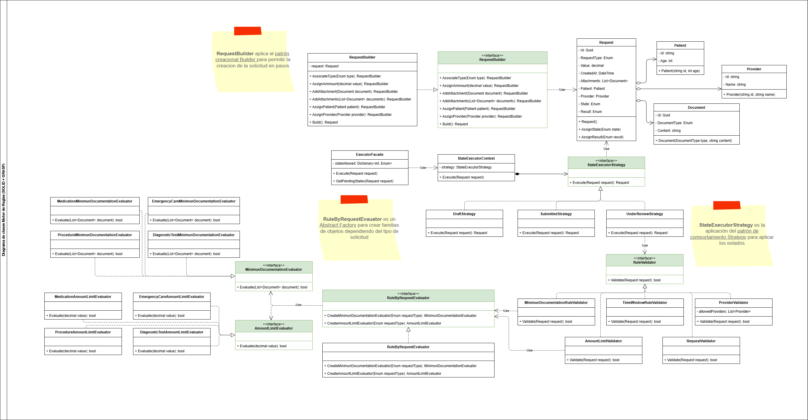

# Aplicación de principios GRASP + SOLID

El ejercicio propuesto para esta actividad de aplicación de principios **SOLID** + **GRASP** se encuentra descrito en el siguiente [enlace](https://docs.google.com/document/d/1yi2JK0nAG5cq-fB9fTvcqME1dWHJywApGTHBHi73j3U/edit?pli=1&tab=t.0#heading=h.m88trwz9i64x)

## Diagrama de clases

## Referencias

- [Strategy](https://refactoring.guru/es/design-patterns/strategy)
- [Strategy Pattern](https://www.geeksforgeeks.org/system-design/strategy-pattern-set-1/)
- [Abstract Factory](https://refactoring.guru/es/design-patterns/abstract-factory)
- [Builder](https://refactoring.guru/es/design-patterns/builder)
